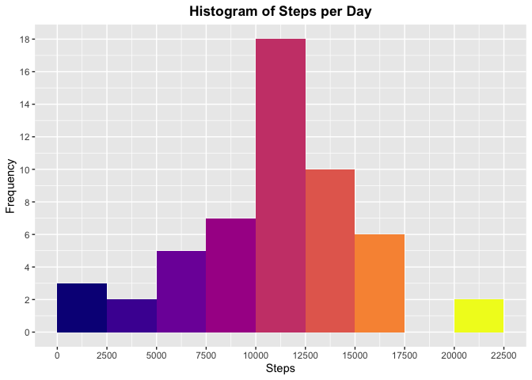
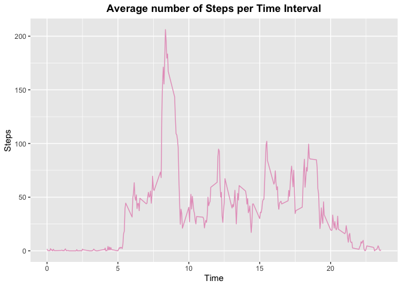
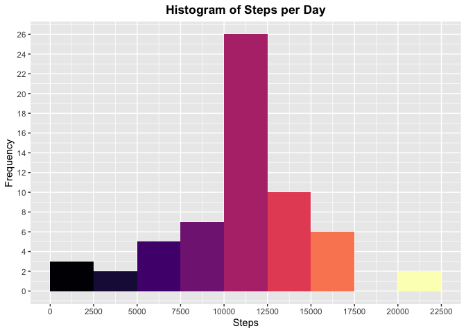
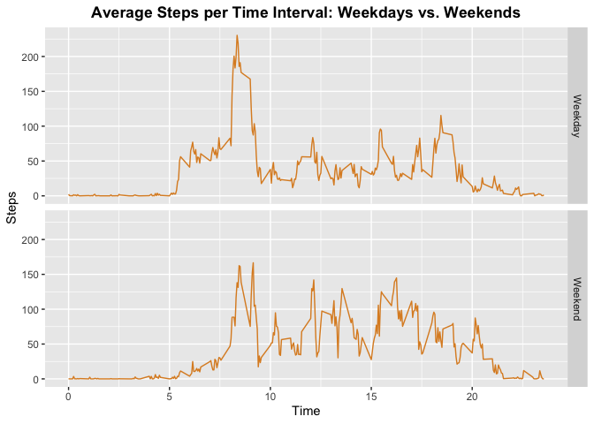

Reproducible Research: Peer Assessment 1
========================================

*The dataset can be downloaded
[here](https://github.com/sofiariccomagno/RepData_PeerAssessment1/blob/master/activity.zip).
More information can be found in the
[README](https://github.com/sofiariccomagno/RepData_PeerAssessment1/blob/master/README.md).*

Loading and preprocessing the data
----------------------------------

### Show any code that is needed to

1.  Load the data (i.e. read.csv())
2.  Process/transform the data (if necessary) into a suitable format for
    your analysis

<!-- -->

    #Load the dataset into RStudio
    activity<-read.csv("activity.csv")

    #Load libraries for graphs and pretty colours
    library(ggplot2)
    library(dplyr)
    library(viridis)
    library(wesanderson)

    #Check the dataset loaded correctly and find out more about the variables
    str(activity)

    ## 'data.frame':    17568 obs. of  3 variables:
    ##  $ steps   : int  NA NA NA NA NA NA NA NA NA NA ...
    ##  $ date    : Factor w/ 61 levels "2012-10-01","2012-10-02",..: 1 1 1 1 1 1 1 1 1 1 ...
    ##  $ interval: int  0 5 10 15 20 25 30 35 40 45 ...

The variables included in the dataset are:  
- **steps**: Number of steps taking in a 5-minute interval (missing
values are coded as NA)  
- **date**: The date on which the measurement was taken in YYYY-MM-DD
format  
- **interval**: Identifier for the 5-minute interval in which
measurement was taken

What is mean total number of steps taken per day?
-------------------------------------------------

### For this part of the assignment, you can ignore the missing values in the dataset.

1.  Calculate the total number of steps taken per day
2.  Make a histogram of the total number of steps taken each day
3.  Calculate and report the mean and median of the total number of
    steps taken per day

<!-- -->

    #Point 1
    StepsPerDay<-aggregate(activity$steps, by=list(activity$date), FUN=sum)
    colnames(StepsPerDay)<-c("Date", "Steps")
    head(StepsPerDay)

    ##         Date Steps
    ## 1 2012-10-01    NA
    ## 2 2012-10-02   126
    ## 3 2012-10-03 11352
    ## 4 2012-10-04 12116
    ## 5 2012-10-05 13294
    ## 6 2012-10-06 15420

    #Point 2
    g<-ggplot(StepsPerDay,aes(Steps))
    g+geom_histogram(boundary=0,binwidth=2500,fill=plasma(9))+
      ggtitle("Histogram of Steps per Day")+xlab("Steps")+ylab("Frequency")+
      theme(plot.title=element_text(face="bold",hjust=0.5))+
      scale_x_continuous(breaks=seq(0,25000,by=2500))+
      scale_y_continuous(breaks=seq(0,18, by=2))

    ## Warning: Removed 8 rows containing non-finite values (stat_bin).

    #Point 3
    mean(StepsPerDay$Steps,na.rm=TRUE)

    ## [1] 10766.19

    median(StepsPerDay$Steps, na.rm=TRUE)

    ## [1] 10765

What is the average daily activity pattern?
-------------------------------------------

1.  Make a time series plot (i.e. type="l") of the 5-minute interval
    (x-axis) and the average number of steps taken, averaged across all
    days (y-axis)
2.  Which 5-minute interval, on average across all the days in the
    dataset, contains the maximum number of steps?

<!-- -->

    #Point 1
    StepsPerTime<-aggregate(steps ~ interval, data=activity, FUN=mean, na.rm=TRUE)
    StepsPerTime$time<-StepsPerTime$interval/100
    h<-ggplot(StepsPerTime, aes(time,steps))
    h+geom_line(col=wes_palette("GrandBudapest2",1))+
      ggtitle("Average number of Steps per Time Interval")+
      xlab("Time")+ylab("Steps")+theme(plot.title=element_text(face="bold",hjust=0.5))

    #Point 2
    maxsteps<-tbl_df(StepsPerTime)  
    maxsteps%>% select(time, steps) %>% filter(steps==max(maxsteps$steps))

    ## # A tibble: 1 x 2
    ##    time steps
    ##   <dbl> <dbl>
    ## 1  8.35  206.

Imputing missing values
-----------------------

### Note that there are a number of days/intervals where there are missing values (coded as NA). The presence of missing days may introduce bias into some calculations or summaries of the data.

1.  Calculate and report the total number of missing values in the
    dataset (i.e. the total number of rows with NAs)
2.  Devise a strategy for filling in all of the missing values in the
    dataset. The strategy does not need to be sophisticated. For
    example, you could use the mean/median for that day, or the mean for
    that 5-minute interval, etc.
3.  Create a new dataset that is equal to the original dataset but with
    the missing data filled in.
4.  Make a histogram of the total number of steps taken each day and
    calculate and report the mean and median total number of steps taken
    per day. Do these values differ from the estimates from the first
    part of the assignment? What is the impact of imputing missing data
    on the estimates of the total daily number of steps?

<!-- -->

    #Point 1
    missing<-tbl_df(activity)
    missing %>% filter(is.na(steps)) %>% summarize(missing_values = n())

    ## # A tibble: 1 x 1
    ##   missing_values
    ##            <int>
    ## 1           2304

    #Point 2
    activity$CompleteSteps<-ifelse(is.na(activity$steps),
                                   round(StepsPerTime$steps[match(activity$interval,
                                                                  StepsPerTime$interval)],0), 
                                   activity$steps)
    activityfull<-data.frame(steps=activity$CompleteSteps, interval=activity$interval, 
                             date=activity$date)
    head(activityfull)

    ##   steps interval       date
    ## 1     2        0 2012-10-01
    ## 2     0        5 2012-10-01
    ## 3     0       10 2012-10-01
    ## 4     0       15 2012-10-01
    ## 5     0       20 2012-10-01
    ## 6     2       25 2012-10-01

    #Point 3
    StepsPerDayFull<-aggregate(activityfull$steps, by=list(activityfull$date), FUN=sum)
    colnames(StepsPerDayFull)<-c("Date", "Steps")

    #Point 4
    g<-ggplot(StepsPerDayFull, aes(Steps))
    g+geom_histogram(boundary=0, binwidth=2500, fill=magma(9))+
      ggtitle("Histogram of Steps per Day")+xlab("Steps")+ylab("Frequency")+
      theme(plot.title = element_text(face="bold", hjust=0.5))+
      scale_x_continuous(breaks=seq(0,25000,by=2500))+scale_y_continuous(breaks=seq(0,26,by=2))

    mean(StepsPerDayFull$Steps)

    ## [1] 10765.64

    median(StepsPerDayFull$Steps)

    ## [1] 10762

We can see that omitting the NAs doesn't significantly change the values
of mean and median.

Are there differences in activity patterns between weekdays and weekends?
-------------------------------------------------------------------------

### For this part the weekdays() function may be of some help here. Use the dataset with the filled-in missing values for this part.

1.  Create a new factor variable in the dataset with two levels –
    “weekday” and “weekend” indicating whether a given date is a weekday
    or weekend day.
2.  Make a panel plot containing a time series plot (i.e.type="l") of
    the 5-minute interval (x-axis) and the average number of steps
    taken, averaged across all weekday days or weekend days (y-axis).
    See the README file in the GitHub repository to see an example of
    what this plot should look like using simulated data.

<!-- -->

    #Point 1
    activityfull$RealDate<-as.Date(activityfull$date, format = "%Y-%m-%d")
    activityfull$Weekday<-weekdays(activityfull$RealDate)
    activityfull$DayType<-ifelse(activityfull$Weekday=='Saturday' | activityfull$Weekday=='Sunday',
                                   'Weekend','Weekday')
    head(activityfull)

    ##   steps interval       date   RealDate Weekday DayType
    ## 1     2        0 2012-10-01 2012-10-01  Monday Weekday
    ## 2     0        5 2012-10-01 2012-10-01  Monday Weekday
    ## 3     0       10 2012-10-01 2012-10-01  Monday Weekday
    ## 4     0       15 2012-10-01 2012-10-01  Monday Weekday
    ## 5     0       20 2012-10-01 2012-10-01  Monday Weekday
    ## 6     2       25 2012-10-01 2012-10-01  Monday Weekday

    #Point 2
    StepsPerTimeWK<-aggregate(steps~interval+DayType,data=activityfull,FUN=mean,na.rm=TRUE)
    StepsPerTimeWK$time<-StepsPerTime$interval/100
    j<-ggplot(StepsPerTimeWK, aes(time, steps))
    j+geom_line(col=wes_palette("FantasticFox1",1))+
      ggtitle("Average Steps per Time Interval: Weekdays vs. Weekends")+
      xlab("Time")+ylab("Steps")+
      theme(plot.title = element_text(face="bold", hjust=0.5))+
      facet_grid(DayType ~ .)

